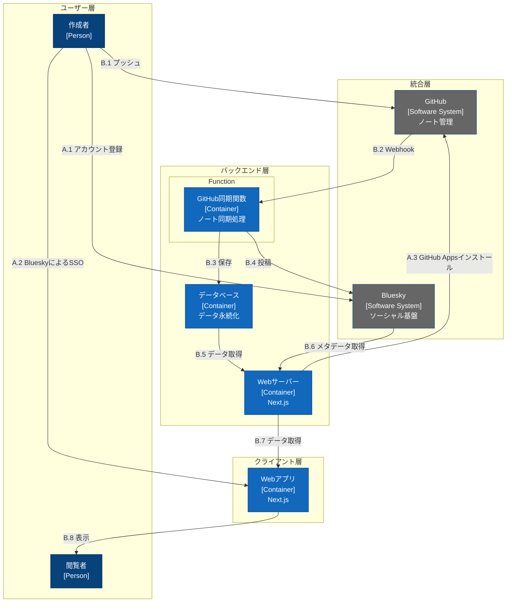

# システムワークフロー

これはGitHunに保存されたMarkdownテキストを

- データベースに保存
- Bluesky（AT Protocol）に投稿

し、Webページとして表示するシステムです。

## 凡例

- Person: システムのユーザー（青色）
- Software System: 外部システム（灰色）
- Container: 内部コンポーネント（水色）
- A.x: アカウント管理フロー
- B.x: ノート作成・配信フロー
