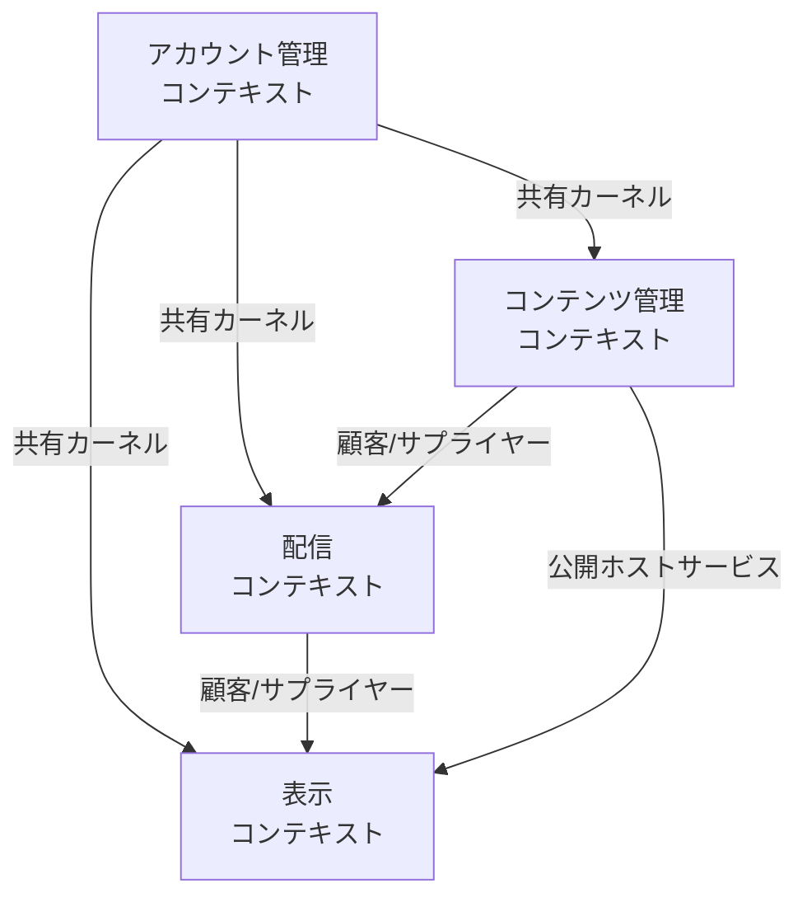
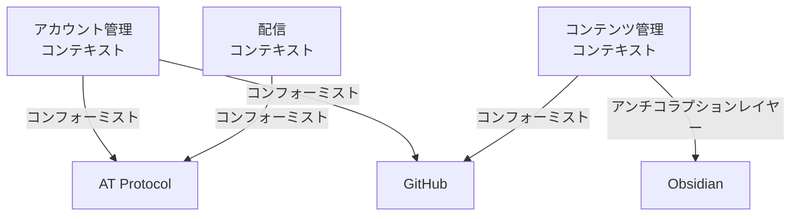
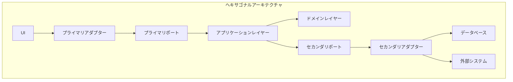
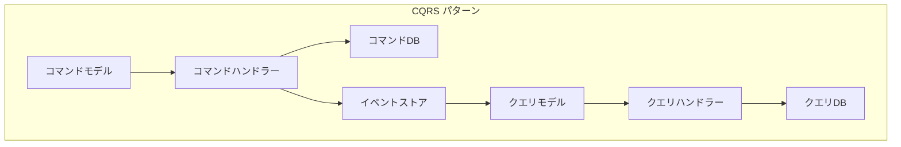
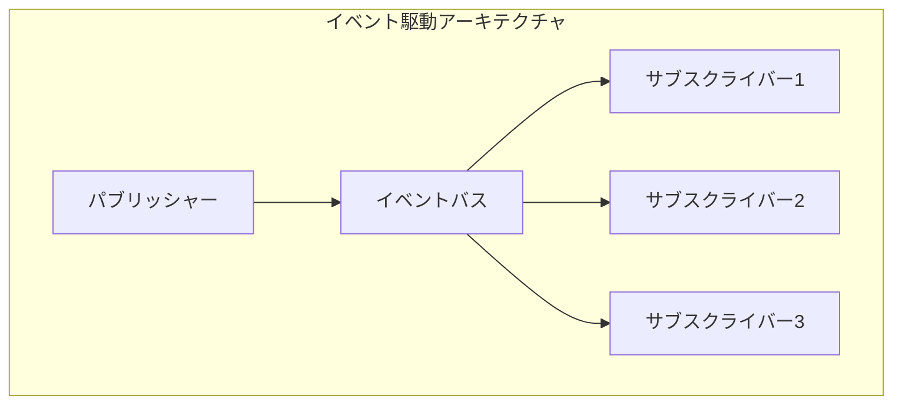

# ドメイン駆動設計戦略

このドキュメントでは、[domain-model.md](./domain-model.md)で特定された境界づけられたコンテキストに基づいて、ドメイン駆動設計の戦略的側面を詳細に記述します。

## 1. ユビキタス言語の定義

システム開発において共通の言語を確立することは非常に重要です。以下に主要な用語を定義します。

### 主要な用語

| 用語 | 定義 |
|------|------|
| ユーザー | システムを利用する人物。作成者と閲覧者に分類される |
| 作成者 | コンテンツを作成・編集・公開するユーザー |
| 閲覧者 | 公開されたコンテンツを閲覧するユーザー |
| コンテンツ | マークダウン形式で作成された文書 |
| リポジトリ | GitHubにおけるコンテンツの保存場所 |
| フィード | AT Protocolを通じて配信されるコンテンツの流れ |
| ポスト | AT Protocolに投稿される個々のコンテンツ単位 |
| 同期 | GitHubとAT Protocol間でのコンテンツの整合性を保つ処理 |

## 2. 戦略的設計の詳細化

### 2.1 コアドメインの特定

このシステムのコアドメインは以下の通りです：

1. **コンテンツ管理ドメイン**
   - マークダウンコンテンツの作成・編集・バージョン管理
   - GitHubリポジトリとの同期

2. **配信ドメイン**
   - AT Protocolを通じたコンテンツの配信
   - フィード管理と更新通知

これらのドメインは、システムの中核的な価値提案であり、最も注力すべき領域です。

### 2.2 サポートドメイン

1. **アカウント管理ドメイン**
   - ユーザー認証・認可
   - 外部システム（GitHub、AT Protocol）との連携

2. **表示ドメイン**
   - Webアプリでのコンテンツレンダリング
   - ユーザーインターフェース

### 2.3 汎用ドメイン

1. **通知ドメイン**
   - システム内の各種通知管理
   - ユーザーへのアラート

2. **分析ドメイン**
   - コンテンツの閲覧統計
   - ユーザー行動分析

## 3. 境界づけられたコンテキストの詳細設計

各コンテキストの責務と主要な構成要素を定義します。詳細なドメインモデルは[domain-models.md](./domain-models.md)を参照してください。

### 3.1 アカウント管理コンテキスト

**責務**:
- ユーザー登録・認証
- AT Protocolとの認証連携
- GitHubとの認証連携

**主要なエンティティと値オブジェクト**:
- User（エンティティ）
- Credentials（値オブジェクト）
- ATAccount（エンティティ）
- GitHubIntegration（エンティティ）

**集約**:
- UserAggregate（ルートエンティティ: User）

**ドメインサービス**:
- AuthenticationService
- IntegrationService

### 3.2 コンテンツ管理コンテキスト

**責務**:
- マークダウンコンテンツの管理
- GitHubリポジトリとの同期
- コンテンツのバージョン管理

**主要なエンティティと値オブジェクト**:
- Content（エンティティ）
- ContentMetadata（値オブジェクト）
- Repository（エンティティ）
- Version（値オブジェクト）

**集約**:
- ContentAggregate（ルートエンティティ: Content）
- RepositoryAggregate（ルートエンティティ: Repository）

**ドメインサービス**:
- ContentSyncService
- VersioningService

### 3.3 配信コンテキスト

**責務**:
- AT Protocolへのコンテンツ配信
- フィード管理
- 更新通知の処理

**主要なエンティティと値オブジェクト**:
- Post（エンティティ）
- Feed（エンティティ）
- PublishStatus（値オブジェクト）
- FeedMetadata（値オブジェクト）

**集約**:
- PostAggregate（ルートエンティティ: Post）
- FeedAggregate（ルートエンティティ: Feed）

**ドメインサービス**:
- PublishingService
- FeedSyncService

### 3.4 表示コンテキスト

**責務**:
- コンテンツのレンダリング
- ユーザーインターフェース管理
- ページ生成

**主要なエンティティと値オブジェクト**:
- Page（エンティティ）
- RenderingOptions（値オブジェクト）
- ViewTemplate（エンティティ）

**集約**:
- PageAggregate（ルートエンティティ: Page）

**ドメインサービス**:
- RenderingService
- PageCompositionService

## 4. コンテキストマップの詳細化

### 4.1 コンテキスト間の関係

### 4.2 外部システムとの関係

## 5. ドメインイベントの設計

システム内で発生する主要なドメインイベントを定義します：

### 5.1 アカウント管理コンテキスト
- UserRegistered
- UserAuthenticated
- GitHubIntegrationCompleted
- ATProtocolIntegrationCompleted

### 5.2 コンテンツ管理コンテキスト
- ContentCreated
- ContentUpdated
- ContentDeleted
- RepositorySynchronized
- VersionCreated

### 5.3 配信コンテキスト
- PostPublished
- FeedUpdated
- NotificationReceived
- PublishFailed

### 5.4 表示コンテキスト
- PageRendered
- ViewConfigurationChanged

## 6. 実装アーキテクチャ

### 6.1 ヘキサゴナルアーキテクチャ

各境界づけられたコンテキストは、ヘキサゴナルアーキテクチャ（ポートとアダプター）パターンに従って実装します：

### 6.2 CQRS パターン

特に配信コンテキストと表示コンテキストでは、CQRS（Command Query Responsibility Segregation）パターンを採用します：

### 6.3 イベント駆動アーキテクチャ

コンテキスト間の連携には、イベント駆動アーキテクチャを採用します：

## 7. 実装戦略

実装の詳細については、[implementation-plan.md](./implementation-plan.md)を参照してください。

### 7.1 技術スタックの選定

- フロントエンド: Next.js 15, TypeScript, Tailwind CSS, shadcn/ui
- バックエンド: Hono, Next.js サーバーアクション
- データベース: PostgreSQL, Drizzle ORM
- 外部システム連携: GitHub API, AT Protocol SDK

### 7.2 モジュール構成

- ヘキサゴナルアーキテクチャに基づいたレイヤー構造
- 境界づけられたコンテキストごとのモジュール分割
- 共通コアモジュールの設計

### 7.3 開発フェーズ

1. **フェーズ1**: コアドメイン（コンテンツ管理、配信）の実装
2. **フェーズ2**: サポートドメイン（アカウント管理、表示）の実装
3. **フェーズ3**: 統合とテスト
4. **フェーズ4**: 最適化とリリース

## 8. 次のステップ

1. 詳細なドメインモデルの設計 → [domain-models.md](./domain-models.md)
2. 実装計画の策定 → [implementation-plan.md](./implementation-plan.md)
3. プロトタイプ開発と検証 