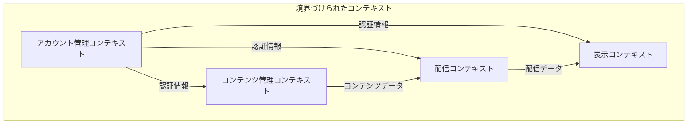
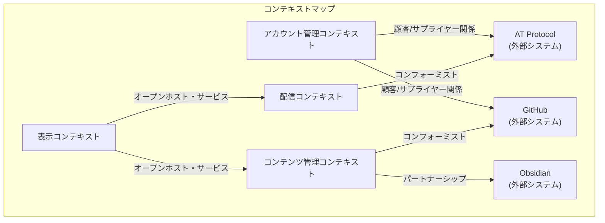

# ドメイン駆動設計モデリング - 基本設計

このドキュメントでは、AT-MDシステムのドメイン駆動設計における基本的なモデリングを行います。詳細な設計は関連ドキュメントを参照してください。

## 戦略的設計（Strategic Design）

### ドメイン分析

システムワークフローから以下の主要なドメインを特定できます：

1. **アカウント管理ドメイン**
   - ユーザー認証・認可
   - AT Protocolとの連携
   - GitHubとの連携

2. **コンテンツ管理ドメイン**
   - マークダウンコンテンツの作成・編集
   - GitHubリポジトリとの同期
   - コンテンツのバージョン管理

3. **配信ドメイン**
   - AT Protocolを通じたコンテンツ配信
   - フィード管理
   - 通知管理

4. **表示ドメイン**
   - Webアプリでのコンテンツレンダリング
   - ユーザーインターフェース

### 境界づけられたコンテキスト（Bounded Contexts）

各ドメインを境界づけられたコンテキストとして定義します：

### コンテキストマップ（Context Map）

各境界づけられたコンテキスト間の関係を定義します：

## 戦術的設計（Tactical Design）の概要

各コンテキストの主要な構成要素を簡潔に示します。詳細は [domain-models.md](./domain-models.md) を参照してください。

### アカウント管理コンテキスト

- **エンティティ**: User, ATAccount, GitHubIntegration
- **値オブジェクト**: Credentials, Token
- **集約**: UserAccount
- **リポジトリ**: UserRepository
- **サービス**: AuthenticationService, GitHubIntegrationService

### コンテンツ管理コンテキスト

- **エンティティ**: Content, Repository
- **値オブジェクト**: ContentMetadata, Version
- **集約**: ContentRepository
- **リポジトリ**: ContentRepository
- **サービス**: GitHubSyncService, ContentVersioningService

### 配信コンテキスト

- **エンティティ**: Post, Feed
- **値オブジェクト**: PostMetadata, Notification
- **集約**: UserFeed
- **リポジトリ**: PostRepository, FeedRepository
- **サービス**: ATProtocolPublishService, FeedSyncService

### 表示コンテキスト

- **エンティティ**: Page, View
- **値オブジェクト**: PageMetadata, RenderingOptions
- **集約**: UserView
- **リポジトリ**: PageRepository
- **サービス**: RenderingService, ViewCompositionService

## ドメインイベント

システム内で発生する主要なドメインイベントを定義します：

1. **UserRegistered**: ユーザー登録完了
2. **GitHubIntegrationCompleted**: GitHub連携完了
3. **ContentCreated**: コンテンツ作成
4. **ContentUpdated**: コンテンツ更新
5. **ContentPublished**: コンテンツ配信
6. **FeedUpdated**: フィード更新

## 実装戦略の概要

1. **ヘキサゴナルアーキテクチャ**の採用
   - ドメインロジックを外部依存から分離
   - アダプターを通じて外部システムと連携

2. **CQRS（Command Query Responsibility Segregation）**パターンの検討
   - 書き込みと読み取りの責務を分離
   - 特に配信ドメインと表示ドメインで有効

3. **イベント駆動アーキテクチャ**の採用
   - ドメインイベントを通じたコンテキスト間の疎結合な連携
   - 非同期処理による柔軟なスケーリング

4. **マイクロサービスアーキテクチャ**の検討
   - 境界づけられたコンテキストごとのサービス分割
   - 独立したデプロイと運用

## 次のステップ

詳細な設計と実装計画については、以下のドキュメントを参照してください：

1. [ddd-strategy.md](./ddd-strategy.md) - ユビキタス言語の定義と戦略的設計の詳細
2. [domain-models.md](./domain-models.md) - 各コンテキストの詳細なドメインモデル
3. [implementation-plan.md](./implementation-plan.md) - 実装計画と技術スタック 