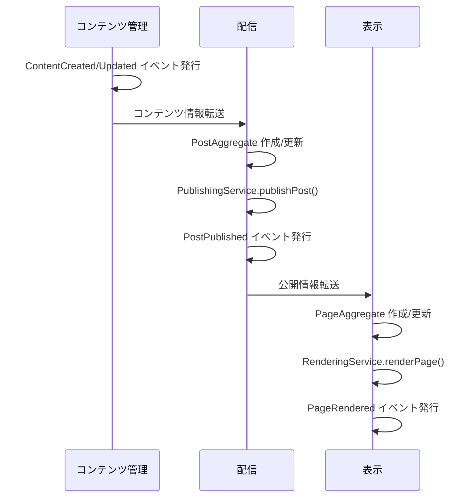
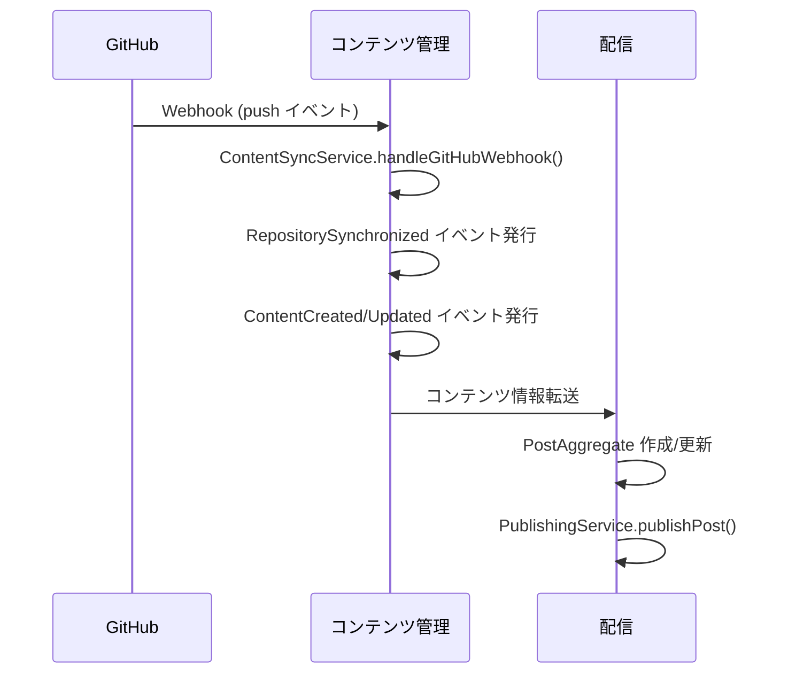
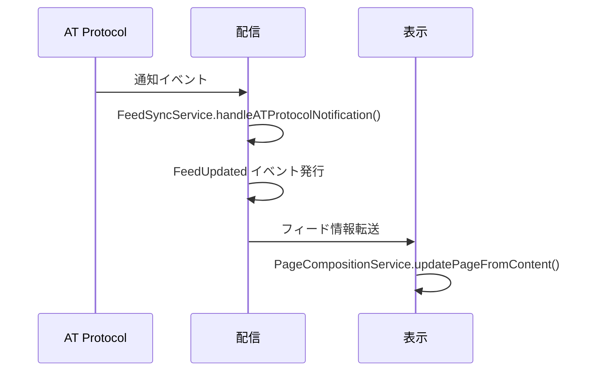

# ドメインモデル詳細設計

このドキュメントでは、[domain-model.md](./domain-model.md)で特定された境界づけられたコンテキストと[ddd-strategy.md](./ddd-strategy.md)で定義された戦略に基づいて、各コンテキストにおけるドメインモデルの詳細設計を記述します。ここで定義されたドメインモデルは、[implementation-plan.md](./implementation-plan.md)の実装計画の基礎となります。

## 1. アカウント管理コンテキスト

### 1.1 エンティティ

#### User
```typescript
interface User {
  id: UserId;
  name: UserName;
  email: Email;
  status: UserStatus;
  role: UserRole;
  createdAt: DateTime;
  updatedAt: DateTime;
}

type UserId = string;
type UserName = string;
type Email = string;
type UserStatus = 'active' | 'inactive' | 'suspended';
type UserRole = 'creator' | 'viewer' | 'admin';
```

#### ATAccount
```typescript
interface ATAccount {
  id: ATAccountId;
  userId: UserId;
  handle: ATHandle;
  did: DID;
  status: ConnectionStatus;
  createdAt: DateTime;
  updatedAt: DateTime;
}

type ATAccountId = string;
type ATHandle = string;
type DID = string;
type ConnectionStatus = 'connected' | 'disconnected' | 'pending';
```

#### GitHubIntegration
```typescript
interface GitHubIntegration {
  id: GitHubIntegrationId;
  userId: UserId;
  installationId: GitHubInstallationId;
  repositories: Repository[];
  status: ConnectionStatus;
  createdAt: DateTime;
  updatedAt: DateTime;
}

type GitHubIntegrationId = string;
type GitHubInstallationId = string;
```

### 1.2 値オブジェクト

#### Credentials
```typescript
interface Credentials {
  accessToken: string;
  refreshToken: string;
  expiresAt: DateTime;
  scope: string[];
}
```

#### AuthenticationResult
```typescript
interface AuthenticationResult {
  user: User;
  credentials: Credentials;
  isNewUser: boolean;
}
```

### 1.3 集約

#### UserAggregate
```typescript
class UserAggregate {
  private user: User;
  private atAccount?: ATAccount;
  private githubIntegration?: GitHubIntegration;
  
  constructor(user: User) {
    this.user = user;
  }
  
  // ファクトリーメソッド
  static create(name: UserName, email: Email): UserAggregate {
    // 新規ユーザー作成ロジック
  }
  
  // コマンドメソッド
  connectATAccount(handle: ATHandle, did: DID): void {
    // AT Protocolアカウント連携ロジック
  }
  
  connectGitHub(installationId: GitHubInstallationId): void {
    // GitHub連携ロジック
  }
  
  // クエリメソッド
  isConnectedToAT(): boolean {
    return !!this.atAccount && this.atAccount.status === 'connected';
  }
  
  isConnectedToGitHub(): boolean {
    return !!this.githubIntegration && this.githubIntegration.status === 'connected';
  }
}
```

### 1.4 リポジトリインターフェース

```typescript
interface UserRepository {
  findById(id: UserId): Promise<UserAggregate | null>;
  findByEmail(email: Email): Promise<UserAggregate | null>;
  findByATHandle(handle: ATHandle): Promise<UserAggregate | null>;
  save(user: UserAggregate): Promise<void>;
}
```

### 1.5 ドメインサービス

```typescript
interface AuthenticationService {
  authenticateWithAT(code: string): Promise<AuthenticationResult>;
  authenticateWithGitHub(code: string): Promise<AuthenticationResult>;
  refreshATToken(refreshToken: string): Promise<Credentials>;
}

interface IntegrationService {
  setupGitHubIntegration(userId: UserId, code: string): Promise<GitHubIntegration>;
  setupATIntegration(userId: UserId, code: string): Promise<ATAccount>;
}
```

## 2. コンテンツ管理コンテキスト

### 2.1 エンティティ

#### Content
```typescript
interface Content {
  id: ContentId;
  userId: UserId;
  repositoryId: RepositoryId;
  path: FilePath;
  title: ContentTitle;
  body: ContentBody;
  metadata: ContentMetadata;
  versions: Version[];
  status: ContentStatus;
  createdAt: DateTime;
  updatedAt: DateTime;
}

type ContentId = string;
type FilePath = string;
type ContentTitle = string;
type ContentBody = string;
type ContentStatus = 'draft' | 'published' | 'archived';
```

#### Repository
```typescript
interface Repository {
  id: RepositoryId;
  userId: UserId;
  name: RepositoryName;
  owner: RepositoryOwner;
  defaultBranch: BranchName;
  lastSyncedAt: DateTime;
  status: RepositoryStatus;
  createdAt: DateTime;
  updatedAt: DateTime;
}

type RepositoryId = string;
type RepositoryName = string;
type RepositoryOwner = string;
type BranchName = string;
type RepositoryStatus = 'active' | 'inactive' | 'syncing';
```

### 2.2 値オブジェクト

#### ContentMetadata
```typescript
interface ContentMetadata {
  tags: string[];
  categories: string[];
  publishedAt?: DateTime;
  lastPublishedAt?: DateTime;
  excerpt?: string;
  featuredImage?: string;
  language: string;
  readingTime?: number;
}
```

#### Version
```typescript
interface Version {
  id: VersionId;
  contentId: ContentId;
  commitId: CommitId;
  createdAt: DateTime;
  changes: ContentChanges;
}

type VersionId = string;
type CommitId = string;

interface ContentChanges {
  title?: ContentTitle;
  body?: ContentBody;
  metadata?: Partial<ContentMetadata>;
}
```

### 2.3 集約

#### ContentAggregate
```typescript
class ContentAggregate {
  private content: Content;
  
  constructor(content: Content) {
    this.content = content;
  }
  
  // ファクトリーメソッド
  static create(
    userId: UserId,
    repositoryId: RepositoryId,
    path: FilePath,
    title: ContentTitle,
    body: ContentBody,
    metadata: ContentMetadata
  ): ContentAggregate {
    // 新規コンテンツ作成ロジック
  }
  
  // コマンドメソッド
  update(title: ContentTitle, body: ContentBody, metadata: ContentMetadata): void {
    // コンテンツ更新ロジック
  }
  
  publish(): void {
    // 公開ステータス変更ロジック
  }
  
  archive(): void {
    // アーカイブステータス変更ロジック
  }
  
  addVersion(commitId: CommitId, changes: ContentChanges): void {
    // バージョン追加ロジック
  }
  
  // クエリメソッド
  isPublished(): boolean {
    return this.content.status === 'published';
  }
  
  getLatestVersion(): Version | undefined {
    return this.content.versions[this.content.versions.length - 1];
  }
}
```

#### RepositoryAggregate
```typescript
class RepositoryAggregate {
  private repository: Repository;
  
  constructor(repository: Repository) {
    this.repository = repository;
  }
  
  // ファクトリーメソッド
  static create(
    userId: UserId,
    name: RepositoryName,
    owner: RepositoryOwner,
    defaultBranch: BranchName
  ): RepositoryAggregate {
    // 新規リポジトリ作成ロジック
  }
  
  // コマンドメソッド
  startSync(): void {
    // 同期開始ロジック
  }
  
  completeSync(): void {
    // 同期完了ロジック
  }
  
  // クエリメソッド
  isSyncing(): boolean {
    return this.repository.status === 'syncing';
  }
}
```

### 2.4 リポジトリインターフェース

```typescript
interface ContentRepository {
  findById(id: ContentId): Promise<ContentAggregate | null>;
  findByPath(repositoryId: RepositoryId, path: FilePath): Promise<ContentAggregate | null>;
  findByUserId(userId: UserId): Promise<ContentAggregate[]>;
  save(content: ContentAggregate): Promise<void>;
}

interface RepositoryRepository {
  findById(id: RepositoryId): Promise<RepositoryAggregate | null>;
  findByUserIdAndName(userId: UserId, name: RepositoryName): Promise<RepositoryAggregate | null>;
  findByUserId(userId: UserId): Promise<RepositoryAggregate[]>;
  save(repository: RepositoryAggregate): Promise<void>;
}
```

### 2.5 ドメインサービス

```typescript
interface ContentSyncService {
  syncRepository(repositoryId: RepositoryId): Promise<void>;
  syncContent(contentId: ContentId): Promise<void>;
  handleGitHubWebhook(payload: any): Promise<void>;
}

interface VersioningService {
  createVersion(contentId: ContentId, commitId: CommitId, changes: ContentChanges): Promise<Version>;
  compareVersions(versionId1: VersionId, versionId2: VersionId): Promise<ContentChanges>;
}
```

## 3. 配信コンテキスト

### 3.1 エンティティ

#### Post
```typescript
interface Post {
  id: PostId;
  contentId: ContentId;
  userId: UserId;
  atUri: ATURI;
  title: PostTitle;
  text: PostText;
  status: PostStatus;
  publishedAt: DateTime;
  createdAt: DateTime;
  updatedAt: DateTime;
}

type PostId = string;
type ATURI = string;
type PostTitle = string;
type PostText = string;
type PostStatus = 'published' | 'failed' | 'pending';
```

#### Feed
```typescript
interface Feed {
  id: FeedId;
  userId: UserId;
  name: FeedName;
  posts: PostId[];
  metadata: FeedMetadata;
  createdAt: DateTime;
  updatedAt: DateTime;
}

type FeedId = string;
type FeedName = string;
```

### 3.2 値オブジェクト

#### PublishStatus
```typescript
interface PublishStatus {
  status: PostStatus;
  message?: string;
  retryCount: number;
  lastAttemptAt?: DateTime;
}
```

#### FeedMetadata
```typescript
interface FeedMetadata {
  description?: string;
  avatar?: string;
  banner?: string;
  isDefault: boolean;
}
```

### 3.3 集約

#### PostAggregate
```typescript
class PostAggregate {
  private post: Post;
  private publishStatus: PublishStatus;
  
  constructor(post: Post, publishStatus: PublishStatus) {
    this.post = post;
    this.publishStatus = publishStatus;
  }
  
  // ファクトリーメソッド
  static create(
    contentId: ContentId,
    userId: UserId,
    title: PostTitle,
    text: PostText
  ): PostAggregate {
    // 新規ポスト作成ロジック
  }
  
  // コマンドメソッド
  publish(): void {
    // 公開ロジック
  }
  
  markAsFailed(message: string): void {
    // 失敗ステータス設定ロジック
  }
  
  retry(): void {
    // 再試行ロジック
  }
  
  // クエリメソッド
  isPublished(): boolean {
    return this.post.status === 'published';
  }
  
  canRetry(): boolean {
    return this.post.status === 'failed' && this.publishStatus.retryCount < 3;
  }
}
```

#### FeedAggregate
```typescript
class FeedAggregate {
  private feed: Feed;
  
  constructor(feed: Feed) {
    this.feed = feed;
  }
  
  // ファクトリーメソッド
  static create(
    userId: UserId,
    name: FeedName,
    metadata: FeedMetadata
  ): FeedAggregate {
    // 新規フィード作成ロジック
  }
  
  // コマンドメソッド
  addPost(postId: PostId): void {
    // ポスト追加ロジック
  }
  
  removePost(postId: PostId): void {
    // ポスト削除ロジック
  }
  
  updateMetadata(metadata: Partial<FeedMetadata>): void {
    // メタデータ更新ロジック
  }
  
  // クエリメソッド
  isDefault(): boolean {
    return this.feed.metadata.isDefault;
  }
  
  containsPost(postId: PostId): boolean {
    return this.feed.posts.includes(postId);
  }
}
```

### 3.4 リポジトリインターフェース

```typescript
interface PostRepository {
  findById(id: PostId): Promise<PostAggregate | null>;
  findByContentId(contentId: ContentId): Promise<PostAggregate | null>;
  findByUserId(userId: UserId): Promise<PostAggregate[]>;
  save(post: PostAggregate): Promise<void>;
}

interface FeedRepository {
  findById(id: FeedId): Promise<FeedAggregate | null>;
  findByUserId(userId: UserId): Promise<FeedAggregate[]>;
  findDefaultByUserId(userId: UserId): Promise<FeedAggregate | null>;
  save(feed: FeedAggregate): Promise<void>;
}
```

### 3.5 ドメインサービス

```typescript
interface PublishingService {
  publishPost(postId: PostId): Promise<void>;
  republishPost(postId: PostId): Promise<void>;
  unpublishPost(postId: PostId): Promise<void>;
}

interface FeedSyncService {
  syncUserFeed(userId: UserId): Promise<void>;
  handleATProtocolNotification(notification: any): Promise<void>;
}
```

## 4. 表示コンテキスト

### 4.1 エンティティ

#### Page
```typescript
interface Page {
  id: PageId;
  contentId: ContentId;
  slug: PageSlug;
  title: PageTitle;
  content: PageContent;
  template: TemplateId;
  metadata: PageMetadata;
  createdAt: DateTime;
  updatedAt: DateTime;
}

type PageId = string;
type PageSlug = string;
type PageTitle = string;
type PageContent = string;
type TemplateId = string;
```

#### ViewTemplate
```typescript
interface ViewTemplate {
  id: TemplateId;
  name: TemplateName;
  description?: string;
  layout: TemplateLayout;
  components: TemplateComponent[];
  createdAt: DateTime;
  updatedAt: DateTime;
}

type TemplateName = string;
type TemplateLayout = 'default' | 'blog' | 'portfolio' | 'custom';
type TemplateComponent = {
  id: string;
  type: string;
  props: Record<string, any>;
};
```

### 4.2 値オブジェクト

#### PageMetadata
```typescript
interface PageMetadata {
  description?: string;
  ogImage?: string;
  keywords?: string[];
  canonicalUrl?: string;
  publishedAt?: DateTime;
  updatedAt?: DateTime;
}
```

#### RenderingOptions
```typescript
interface RenderingOptions {
  theme: ThemeOption;
  codeHighlighting: boolean;
  tableOfContents: boolean;
  syntaxHighlightingTheme: string;
  renderMath: boolean;
  renderDiagrams: boolean;
}

type ThemeOption = 'light' | 'dark' | 'auto';
```

### 4.3 集約

#### PageAggregate
```typescript
class PageAggregate {
  private page: Page;
  private renderingOptions: RenderingOptions;
  
  constructor(page: Page, renderingOptions: RenderingOptions) {
    this.page = page;
    this.renderingOptions = renderingOptions;
  }
  
  // ファクトリーメソッド
  static create(
    contentId: ContentId,
    slug: PageSlug,
    title: PageTitle,
    content: PageContent,
    template: TemplateId,
    metadata: PageMetadata
  ): PageAggregate {
    // 新規ページ作成ロジック
  }
  
  // コマンドメソッド
  updateContent(content: PageContent): void {
    // コンテンツ更新ロジック
  }
  
  updateMetadata(metadata: Partial<PageMetadata>): void {
    // メタデータ更新ロジック
  }
  
  changeTemplate(templateId: TemplateId): void {
    // テンプレート変更ロジック
  }
  
  updateRenderingOptions(options: Partial<RenderingOptions>): void {
    // レンダリングオプション更新ロジック
  }
  
  // クエリメソッド
  getCanonicalUrl(): string | undefined {
    return this.page.metadata.canonicalUrl;
  }
  
  getLastUpdatedAt(): DateTime {
    return this.page.metadata.updatedAt || this.page.updatedAt;
  }
}
```

### 4.4 リポジトリインターフェース

```typescript
interface PageRepository {
  findById(id: PageId): Promise<PageAggregate | null>;
  findBySlug(slug: PageSlug): Promise<PageAggregate | null>;
  findByContentId(contentId: ContentId): Promise<PageAggregate | null>;
  save(page: PageAggregate): Promise<void>;
}

interface TemplateRepository {
  findById(id: TemplateId): Promise<ViewTemplate | null>;
  findByName(name: TemplateName): Promise<ViewTemplate | null>;
  findAll(): Promise<ViewTemplate[]>;
  save(template: ViewTemplate): Promise<void>;
}
```

### 4.5 ドメインサービス

```typescript
interface RenderingService {
  renderPage(pageId: PageId): Promise<string>;
  renderMarkdown(markdown: string, options: RenderingOptions): Promise<string>;
  generateOgImage(pageId: PageId): Promise<string>;
}

interface PageCompositionService {
  composePage(contentId: ContentId): Promise<PageAggregate>;
  updatePageFromContent(contentId: ContentId): Promise<void>;
}
```

## 5. ドメインイベント

システム全体で発生する主要なドメインイベントを定義します。

### 5.1 アカウント管理コンテキスト

```typescript
interface UserRegistered {
  userId: UserId;
  email: Email;
  timestamp: DateTime;
}

interface UserAuthenticated {
  userId: UserId;
  timestamp: DateTime;
}

interface GitHubIntegrationCompleted {
  userId: UserId;
  integrationId: GitHubIntegrationId;
  repositories: RepositoryId[];
  timestamp: DateTime;
}

interface ATProtocolIntegrationCompleted {
  userId: UserId;
  accountId: ATAccountId;
  handle: ATHandle;
  timestamp: DateTime;
}
```

### 5.2 コンテンツ管理コンテキスト

```typescript
interface ContentCreated {
  contentId: ContentId;
  userId: UserId;
  repositoryId: RepositoryId;
  path: FilePath;
  timestamp: DateTime;
}

interface ContentUpdated {
  contentId: ContentId;
  userId: UserId;
  changes: ContentChanges;
  timestamp: DateTime;
}

interface ContentDeleted {
  contentId: ContentId;
  userId: UserId;
  timestamp: DateTime;
}

interface RepositorySynchronized {
  repositoryId: RepositoryId;
  userId: UserId;
  changedContents: ContentId[];
  timestamp: DateTime;
}

interface VersionCreated {
  versionId: VersionId;
  contentId: ContentId;
  commitId: CommitId;
  timestamp: DateTime;
}
```

### 5.3 配信コンテキスト

```typescript
interface PostPublished {
  postId: PostId;
  contentId: ContentId;
  userId: UserId;
  atUri: ATURI;
  timestamp: DateTime;
}

interface FeedUpdated {
  feedId: FeedId;
  userId: UserId;
  addedPosts: PostId[];
  removedPosts: PostId[];
  timestamp: DateTime;
}

interface NotificationReceived {
  userId: UserId;
  type: string;
  data: any;
  timestamp: DateTime;
}

interface PublishFailed {
  postId: PostId;
  contentId: ContentId;
  userId: UserId;
  reason: string;
  timestamp: DateTime;
}
```

### 5.4 表示コンテキスト

```typescript
interface PageRendered {
  pageId: PageId;
  contentId: ContentId;
  timestamp: DateTime;
}

interface ViewConfigurationChanged {
  userId: UserId;
  templateId: TemplateId;
  timestamp: DateTime;
}
```

## 6. ドメインサービス間の連携

各境界づけられたコンテキスト間の連携を実現するためのドメインサービスの連携フローを定義します。

### 6.1 コンテンツ作成・配信フロー



### 6.2 GitHub同期フロー



### 6.3 AT Protocol同期フロー

