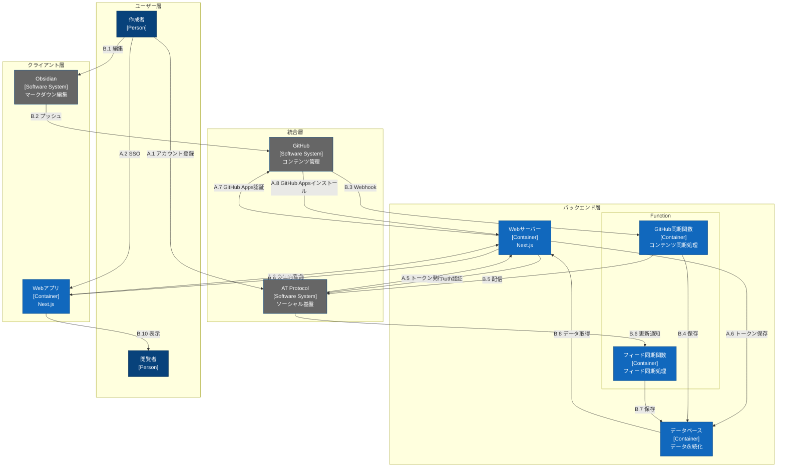

# システムワークフロー

このドキュメントでは、AT-MDシステムの全体的なワークフローを図解します。このワークフローは、[domain-model.md](./domain-model.md)でのドメイン分析の基礎となり、システムの主要なコンポーネントとその相互作用を示しています。

## 凡例

- Person: システムのユーザー（青色）
- Software System: 外部システム（灰色）
- Container: 内部コンポーネント（水色）
- A.x: アカウント管理フロー
- B.x: コンテンツ作成・配信フロー
